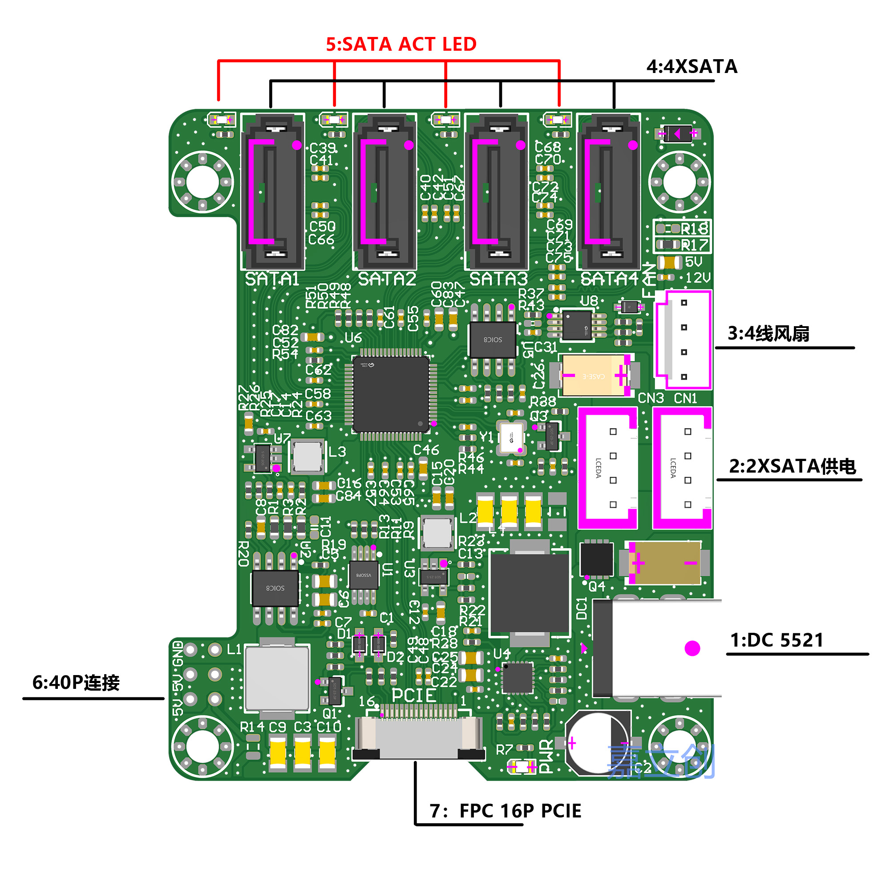

# RPI5、ROCK5C SATA HAT Configuration


## 树莓派
1. 开启PCIE


```shell
sudo rpi-eeprom-config --edit
```
使能PCIE_PROBE:

PCIE_PROBE=1

2. 配置overlay

```shell
wget https://github.com/raspberrypi/rpi-firmware/raw/master/overlays/pciex1-compat-pi5.dtbo
sudo cp pciex1-compat-pi5.dtbo /boot/firmware/overlays
```

```shell
sudo nano /boot/firmware/config.tx

```
并在尾部加入以下内容开启pcie

```shell

dtparam=pciex1_gen=3
dtoverlay=pciex1-compat-pi5,no-mip
```
3. 风扇配置

[rpi5 emc2301 i2c风扇配置](overlays/rpi5)
## ROCK5C
1. 风扇配置

[rock5c emc2301 i2c风扇配置](overlays/rock5c)

# 购买(buy)
[咸鱼-树莓派5、rock5c硬盘扩展板4xsata，带sata供电](https://www.goofish.com/item?spm=a21ybx.search.searchFeedList.1.168640723tHLO0&id=903375047200&categoryId=126856551)
