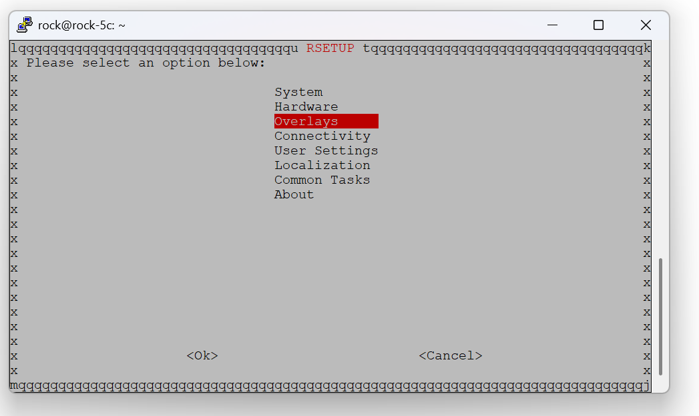
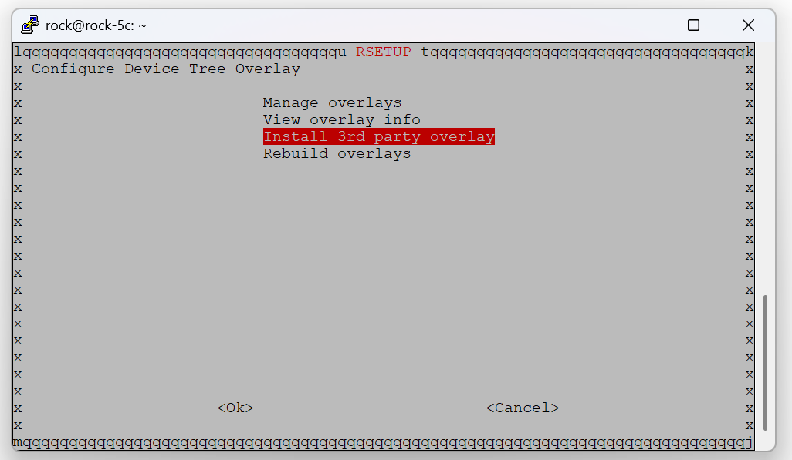
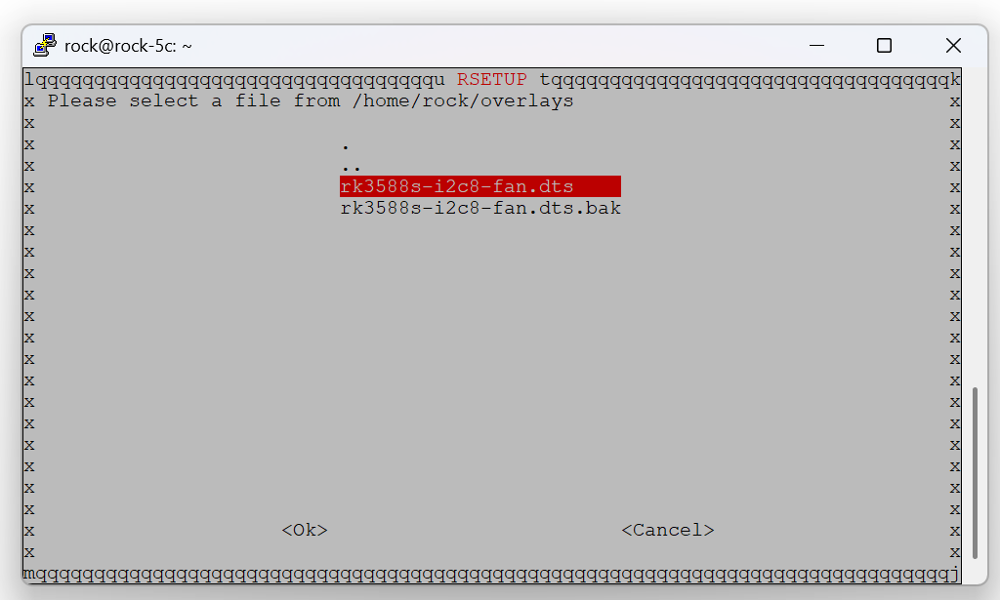
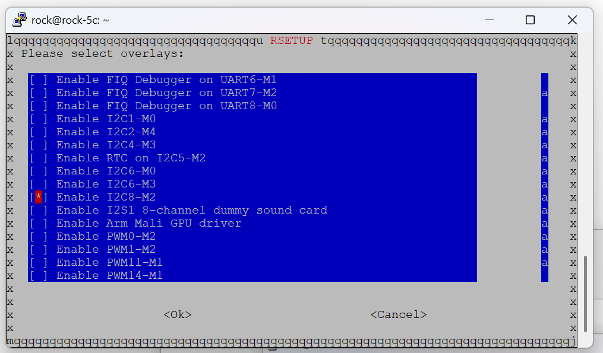

# ROCK5C EMC2301 FAN Configuration

1. get overlay dts
```shell
wget https://raw.githubusercontent.com/lovelycrabs/rpi5-sata/refs/heads/main/overlays/rock5c/rk3588s-i2c8-fan.dts
```

2. install overlay

[可以参考Radxa官方配置说明](https://docs.radxa.com/en/rock5/rock5c/radxa-os/rsetup#overlays)
```shell
sudo rsetup
```





选择overlays>manange overlays, 开启i2c8



